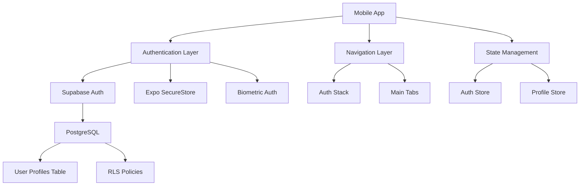
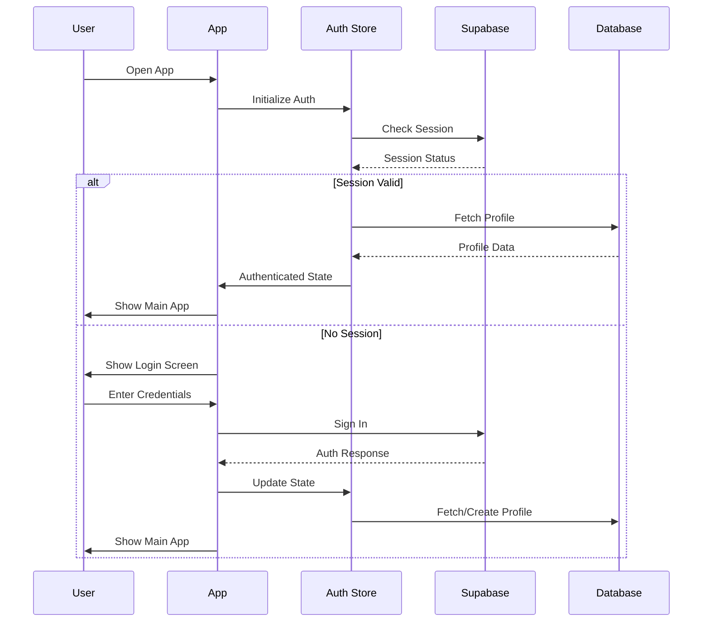
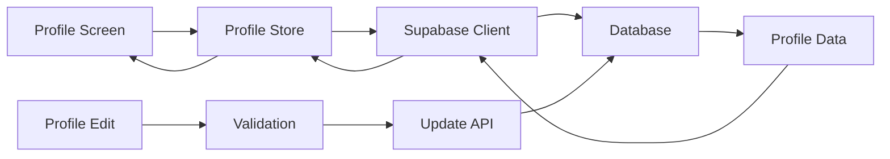

# Design Document

## Overview

Phase 2 focuses on completing the authentication system and core navigation infrastructure for Workers Guild. The design builds upon the existing Supabase integration and Zustand state management to create a robust, secure, and user-friendly authentication experience with proper navigation flow and profile management.

## Architecture

### High-Level Architecture



### Authentication Flow



## Components and Interfaces

### 1. Authentication System

#### Enhanced Auth Store
- **Current State**: Partially implemented with basic auth operations
- **Enhancements Needed**:
  - Add biometric authentication support
  - Implement proper error handling and retry logic
  - Add session refresh handling
  - Integrate with navigation guards

#### Biometric Authentication
- **Implementation**: Expo Local Authentication
- **Features**:
  - Fingerprint/Face ID support
  - Fallback to password authentication
  - Secure storage of biometric preferences
  - Platform-specific handling (iOS/Android)

#### Authentication Guards
- **Route Protection**: Prevent access to protected screens
- **Session Validation**: Automatic session refresh
- **Role-based Access**: Different access levels based on user roles

### 2. Database Schema and Security

#### Database Migrations
```sql
-- User profiles table (already exists, needs RLS)
CREATE TABLE IF NOT EXISTS user_profiles (
    id UUID PRIMARY KEY REFERENCES auth.users(id) ON DELETE CASCADE,
    username TEXT UNIQUE NOT NULL,
    display_name TEXT NOT NULL,
    role TEXT DEFAULT 'individual' CHECK (role IN ('individual', 'leader', 'member')),
    level INTEGER DEFAULT 1,
    experience INTEGER DEFAULT 0,
    evolution_stage INTEGER DEFAULT 1,
    strength INTEGER DEFAULT 0,
    agility INTEGER DEFAULT 0,
    intelligence INTEGER DEFAULT 0,
    endurance INTEGER DEFAULT 0,
    charisma INTEGER DEFAULT 0,
    avatar_url TEXT,
    bio TEXT,
    created_at TIMESTAMPTZ DEFAULT NOW(),
    updated_at TIMESTAMPTZ DEFAULT NOW()
);

-- RLS Policies
ALTER TABLE user_profiles ENABLE ROW LEVEL SECURITY;

CREATE POLICY "Users can view own profile" ON user_profiles
    FOR SELECT USING (auth.uid() = id);

CREATE POLICY "Users can update own profile" ON user_profiles
    FOR UPDATE USING (auth.uid() = id);

CREATE POLICY "Users can insert own profile" ON user_profiles
    FOR INSERT WITH CHECK (auth.uid() = id);

-- Trigger for automatic profile creation
CREATE OR REPLACE FUNCTION public.handle_new_user()
RETURNS TRIGGER AS $$
BEGIN
    INSERT INTO public.user_profiles (id, username, display_name)
    VALUES (
        NEW.id,
        COALESCE(NEW.raw_user_meta_data->>'username', 'user_' || substr(NEW.id::text, 1, 8)),
        COALESCE(NEW.raw_user_meta_data->>'display_name', NEW.email)
    );
    RETURN NEW;
END;
$$ LANGUAGE plpgsql SECURITY DEFINER;

CREATE TRIGGER on_auth_user_created
    AFTER INSERT ON auth.users
    FOR EACH ROW EXECUTE FUNCTION public.handle_new_user();
```

#### Row Level Security (RLS) Policies
- **User Profiles**: Users can only access their own profile data
- **Teams**: Members can view team data, leaders can modify
- **Tasks**: Role-based access with team/guild visibility rules

### 3. Navigation System

#### Enhanced Root Layout
```typescript
// app/_layout.tsx
export default function RootLayout() {
  const { isAuthenticated, initialized } = useAuth();

  if (!initialized) {
    return <LoadingScreen />;
  }

  return (
    <Stack screenOptions={{ headerShown: false }}>
      {isAuthenticated ? (
        <Stack.Screen name="(tabs)" />
      ) : (
        <Stack.Screen name="(auth)" />
      )}
    </Stack>
  );
}
```

#### Authentication Stack
- **Login Screen**: Enhanced with biometric option
- **Register Screen**: Improved validation and UX
- **Forgot Password**: Password reset functionality

#### Main Tab Navigation
- **Tasks Tab**: Task management interface
- **Profile Tab**: User profile and settings
- **Team Tab**: Team collaboration features
- **Home Tab**: Dashboard and overview

### 4. Profile Management System

#### Profile Components
- **ProfileView**: Display user information and stats
- **ProfileEdit**: Edit profile information
- **SkillsDisplay**: Show gamification stats
- **AvatarUpload**: Profile picture management

#### Profile Data Flow


## Data Models

### User Profile Model
```typescript
interface UserProfile {
  id: string;
  username: string;
  display_name: string;
  role: 'individual' | 'leader' | 'member';
  level: number;
  experience: number;
  evolution_stage: number;
  strength: number;
  agility: number;
  intelligence: number;
  endurance: number;
  charisma: number;
  avatar_url?: string;
  bio?: string;
  created_at: string;
  updated_at: string;
}
```

### Authentication State Model
```typescript
interface AuthState {
  session: Session | null;
  user: User | null;
  profile: UserProfile | null;
  loading: boolean;
  initialized: boolean;
  error: string | null;
  biometricEnabled: boolean;
  biometricAvailable: boolean;
}
```

## Error Handling

### Authentication Errors
- **Network Errors**: Retry logic with exponential backoff
- **Invalid Credentials**: Clear error messages
- **Session Expiry**: Automatic refresh or re-authentication
- **Profile Creation Failures**: Fallback mechanisms

### Error Recovery Strategies
- **Offline Support**: Cache authentication state
- **Graceful Degradation**: Fallback to basic features
- **User Feedback**: Clear error messages and recovery actions

## Testing Strategy

### Unit Tests
- **Auth Store**: Test all authentication actions
- **Profile Utils**: Test profile creation and validation
- **Navigation Guards**: Test route protection logic

### Integration Tests
- **Authentication Flow**: End-to-end login/register
- **Profile Management**: CRUD operations
- **Navigation**: Screen transitions and guards

### Security Tests
- **RLS Policies**: Verify data access restrictions
- **Token Handling**: Secure storage and transmission
- **Biometric Integration**: Security and fallback scenarios

## Performance Considerations

### Optimization Strategies
- **Lazy Loading**: Load profile data on demand
- **Caching**: Cache user profile and session data
- **Efficient Queries**: Minimize database calls
- **Image Optimization**: Compress and cache avatars

### Memory Management
- **State Cleanup**: Clear sensitive data on logout
- **Component Unmounting**: Proper cleanup of listeners
- **Image Caching**: Efficient avatar image handling

## Security Measures

### Data Protection
- **Secure Storage**: Use Expo SecureStore for tokens
- **Encryption**: Encrypt sensitive data at rest
- **HTTPS**: All API communications over HTTPS
- **Token Rotation**: Automatic token refresh

### Access Control
- **RLS Policies**: Database-level security
- **Role-based Access**: Feature access based on user roles
- **Session Management**: Secure session handling
- **Biometric Security**: Optional biometric authentication

## Implementation Phases

### Phase 2.1: Database and Security
1. Create database migrations
2. Implement RLS policies
3. Set up automatic profile creation
4. Test security measures

### Phase 2.2: Enhanced Authentication
1. Implement biometric authentication
2. Add authentication guards
3. Improve error handling
4. Add session management

### Phase 2.3: Navigation and UX
1. Implement navigation guards
2. Add screen transitions
3. Improve loading states
4. Add offline support

### Phase 2.4: Profile Management
1. Create profile components
2. Implement profile editing
3. Add avatar upload
4. Test profile workflows