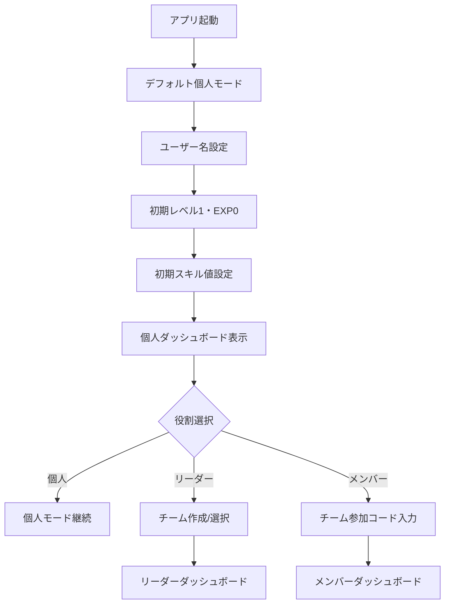
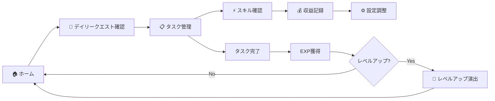
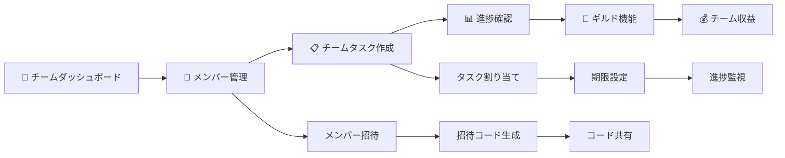
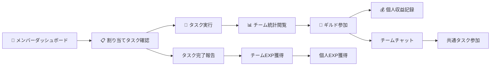
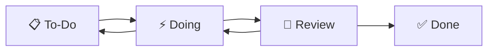
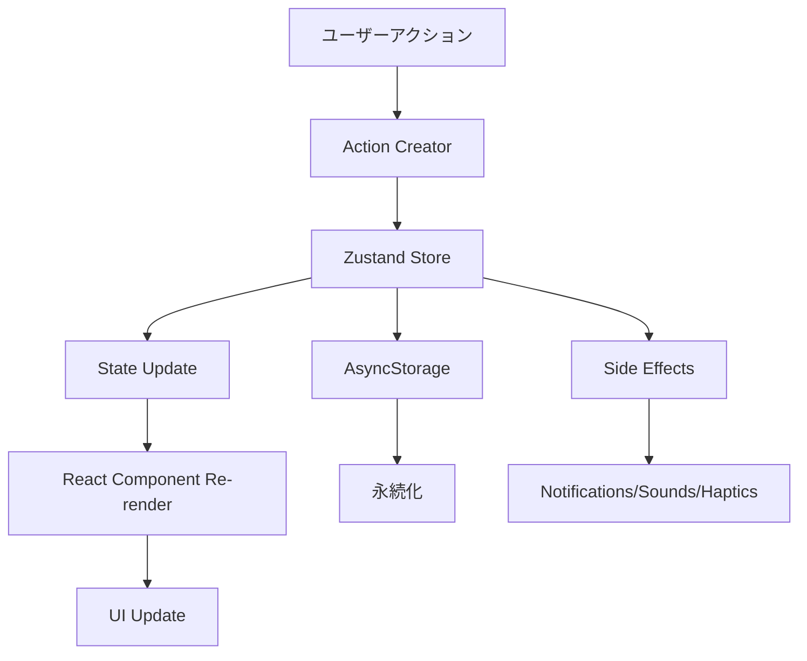

# Workers Guild モバイルアプリ 詳細設計書

## 目次

1. [プロジェクト概要](#プロジェクト概要)
2. [ユーザーフロー分析](#ユーザーフロー分析)
3. [役割別画面仕様](#役割別画面仕様)
4. [機能詳細仕様](#機能詳細仕様)
5. [UI/UXガイドライン](#uiuxガイドライン)
6. [技術アーキテクチャ](#技術アーキテクチャ)

---

## プロジェクト概要

### コンセプト

**Workers Guild** は建設現場作業員向けのタスク管理アプリで、ゲーミフィケーション要素を取り入れ、業務を「RPGのクエスト」として楽しく管理できるアプリケーションです。

### 特徴

- **デュアルテーマシステム**: ビジネスモードとゲームモードの切り替え
- **役割別アクセス制御**: 個人・リーダー・メンバーの3つの役割
- **ゲーミフィケーション**: レベル、EXP、スキル、進化システム
- **チーム機能**: リアルタイムコラボレーション
- **AI推奨システム**: 個人最適化されたタスク提案

---

## ユーザーフロー分析

### 1. 初回登録・オンボーディング



### 2. 個人モード典型フロー



### 3. リーダーモード典型フロー



### 4. メンバーモード典型フロー



---

## 役割別画面仕様

### 個人モード (Individual)

#### 利用可能画面

| 画面名                | ルート      | 説明                             |
| --------------------- | ----------- | -------------------------------- |
| 🏠 個人ダッシュボード | `/personal` | メイン画面・統計表示             |
| 📋 タスク管理         | `/tasks`    | 個人タスクのみ管理               |
| ⚡ スキル管理         | `/skills`   | 個人スキルの可視化・トレーニング |
| 💰 収益管理           | `/revenue`  | 個人収益のみ記録                 |
| 🗺️ ロードマップ       | `/roadmap`  | 個人目標設定                     |
| ⚙️ 設定               | `/settings` | 基本設定                         |

#### UI特徴

- **シンプルなナビゲーション**: 必要最小限のタブ
- **個人フォーカス**: 全ての機能が個人向け
- **権限表示**: 「個人モード」バッジ表示
- **制限メッセージ**: チーム機能への案内表示

### リーダーモード (Leader)

#### 利用可能画面

| 画面名                  | ルート         | 説明                   |
| ----------------------- | -------------- | ---------------------- |
| 👑 チームダッシュボード | `/team`        | チーム統計・管理画面   |
| 👥 チーム管理           | `/team/manage` | メンバー管理・招待機能 |
| 📋 タスク管理           | `/tasks`       | 個人・チームタスク管理 |
| 🏰 ギルド               | `/guild`       | チーム共通機能         |
| ⚡ スキル管理           | `/skills`      | 個人・チームスキル統計 |
| 💰 収益管理             | `/revenue`     | 個人・チーム収益管理   |
| 🗺️ ロードマップ         | `/roadmap`     | 個人・チーム目標設定   |
| ⚙️ 設定                 | `/settings`    | 全設定+メンバー管理    |

#### 権限

```typescript
interface LeaderPermissions {
  canManageTeam: true; // チーム管理
  canCreateTeamTasks: true; // チームタスク作成
  canInviteMembers: true; // メンバー招待
  canViewTeamStats: true; // チーム統計閲覧
  canEditTeamSettings: true; // チーム設定変更
  canAccessGuild: true; // ギルドアクセス
  canSetTeamGoals: true; // チーム目標設定
}
```

#### UI特徴

- **二重レベル表示**: 個人レベル + チームレベル
- **管理機能アクセス**: 「管理」ボタンの表示
- **権限バッジ**: 「👑 リーダーモード」表示
- **拡張ナビゲーション**: 全機能へのアクセス

### メンバーモード (Member)

#### 利用可能画面

| 画面名                    | ルート      | 説明                       |
| ------------------------- | ----------- | -------------------------- |
| 🤝 メンバーダッシュボード | `/member`   | メンバー向けダッシュボード |
| 📋 タスク管理             | `/tasks`    | 割り当てタスクの実行       |
| 🏰 ギルド                 | `/guild`    | チーム共通機能（参加のみ） |
| ⚡ スキル管理             | `/skills`   | 個人スキルのみ             |
| 💰 収益管理               | `/revenue`  | 個人収益のみ               |
| 🗺️ ロードマップ           | `/roadmap`  | 個人目標のみ               |
| ⚙️ 設定                   | `/settings` | 基本設定+チーム情報        |

#### 権限

```typescript
interface MemberPermissions {
  canManageTeam: false; // チーム管理不可
  canCreateTeamTasks: false; // チームタスク作成不可
  canInviteMembers: false; // メンバー招待不可
  canViewTeamStats: true; // チーム統計閲覧可能
  canEditTeamSettings: false; // チーム設定変更不可
  canAccessGuild: true; // ギルドアクセス可能
  canSetTeamGoals: false; // チーム目標設定不可
}
```

#### UI特徴

- **制限表示**: 「リーダーのみ設定可能」メッセージ
- **参照モード**: チーム情報は閲覧のみ
- **権限バッジ**: 「🤝 メンバーモード」表示
- **通知エリア**: 権限についての説明表示

---

## 機能詳細仕様

### 1. タスク管理システム

#### データ構造

```typescript
interface Task {
  id: string; // 一意識別子
  title: string; // タスクタイトル
  description?: string; // 詳細説明
  status: TaskStatus; // ステータス
  priority: TaskPriority; // 優先度
  expReward: number; // 報酬EXP
  assignedTo?: string; // 担当者ID
  teamId?: string; // チームID
  dueDate?: Date; // 期限
  attachments?: string[]; // 添付ファイル
  subtasks?: SubTask[]; // サブタスク
  createdAt: Date; // 作成日時
  updatedAt: Date; // 更新日時
}

type TaskStatus = 'todo' | 'doing' | 'review' | 'done';
type TaskPriority = 'low' | 'medium' | 'high';

interface SubTask {
  id: string;
  title: string;
  completed: boolean;
  createdAt: Date;
}
```

#### 主要機能

1. **カンバンボード**: ドラッグ&ドロップでステータス変更
2. **詳細管理**: サブタスク、添付ファイル、期限設定
3. **権限制御**: 役割に応じたタスク操作権限
4. **通知システム**: 期限切れ、割り当て通知

#### ステータス遷移



### 2. ゲーミフィケーションシステム

#### レベルシステム

```typescript
// レベル計算式
const calculateExpForLevel = (level: number): number => {
  return Math.floor(1000 * Math.pow(1.5, level - 1));
};

// レベルアップ判定
const checkLevelUp = (currentExp: number, currentLevel: number): boolean => {
  const requiredExp = calculateExpForLevel(currentLevel + 1);
  return currentExp >= requiredExp;
};
```

#### スキルシステム

```typescript
interface Skills {
  communication: number; // コミュニケーション (0-100)
  technical: number; // 技術力 (0-100)
  leadership: number; // リーダーシップ (0-100)
  stamina: number; // スタミナ (0-100)
  safety: number; // 安全性 (0-100)
}

// 進化段階計算
const getEvolutionStage = (skills: Skills): number => {
  const average = Object.values(skills).reduce((a, b) => a + b) / 5;
  if (average >= 85) return 4; // 👑 マスター
  if (average >= 75) return 3; // 👷 エキスパート
  if (average >= 65) return 2; // 🛠️ スペシャリスト
  return 1; // 🐣 ビギナー
};
```

#### EXP報酬システム

| アクション       | 基本EXP | 条件                   |
| ---------------- | ------- | ---------------------- |
| タスク完了       | 20-50   | 優先度により変動       |
| デイリークエスト | 40-80   | クエスト種類により変動 |
| チームタスク完了 | +10     | チーム参加時のボーナス |
| 連続達成         | +5-20   | 連続日数により変動     |

### 3. チーム管理機能

#### チームデータ構造

```typescript
interface Team {
  id: string;
  name: string;
  description?: string;
  avatar?: string;
  ownerId: string; // リーダーのユーザーID
  members: TeamMember[];
  tasks: Task[];
  createdAt: Date;
  updatedAt: Date;
  settings: TeamSettings;
}

interface TeamMember {
  id: string;
  name: string;
  role: 'admin' | 'member' | 'viewer';
  avatar?: string;
  level: number;
  exp: number;
  skills: Skills;
  joinedAt: Date;
  lastActive: Date;
}

interface TeamSettings {
  visibility: 'public' | 'private';
  allowInvites: boolean;
  requireApproval: boolean;
}
```

#### 招待システム

```typescript
// 招待コード生成（モック実装）
const generateInviteCode = (teamId: string): string => {
  return `TEAM-${teamId.toUpperCase().slice(-6)}`;
};

// 招待フロー
const inviteFlow = {
  1: 'リーダーが招待コード生成',
  2: 'コードを新メンバーに共有',
  3: '新メンバーがコード入力',
  4: 'チームに自動参加',
};
```

### 4. 収益管理機能

#### データ構造

```typescript
interface RevenueEntry {
  id: string;
  title: string;
  amount: number; // 正数=収入、負数=支出
  type: 'income' | 'expense';
  category: string;
  date: Date;
  description?: string;
  teamId?: string; // チーム収益の場合
}

// カテゴリ定義
const revenueCategories = {
  income: ['フリーランス', '副業', 'チーム', 'ボーナス'],
  expense: ['自己投資', '教材費', '交通費', 'ツール代'],
};
```

#### 統計計算

```typescript
const calculateStats = (entries: RevenueEntry[]) => {
  const income = entries.filter((e) => e.type === 'income').reduce((sum, e) => sum + e.amount, 0);

  const expense = entries
    .filter((e) => e.type === 'expense')
    .reduce((sum, e) => sum + Math.abs(e.amount), 0);

  return {
    totalIncome: income,
    totalExpense: expense,
    netIncome: income - expense,
  };
};
```

---

## UI/UXガイドライン

### 1. デュアルテーマシステム

#### ゲームモード (Game Theme)

```typescript
const gameTheme = {
  colors: {
    background: '#667eea', // パープルブルー
    surface: 'rgba(102, 126, 234, 0.1)',
    accent: '#FACC15', // ゴールド
    text: '#FFFFFF',
    glow: 'rgba(250, 204, 21, 0.5)', // アクセントグロー
  },
  gradients: {
    background: ['#667eea', '#764ba2'],
    gameCard: ['rgba(102, 126, 234, 0.6)', 'rgba(168, 237, 234, 0.4)'],
    gameHeader: ['#667eea', '#a8edea'],
  },
  effects: {
    borderRadius: 16, // 大きな角丸
    shadowOpacity: 0.4, // 強いシャドウ
    glow: true, // グロー効果有効
  },
};
```

**特徴:**

- 🎮 RPG風のファンタジー配色
- ✨ グロー効果とパーティクル
- 🎯 大きな角丸とカラフルなグラデーション
- 🎵 豊富なサウンドエフェクト

#### ビジネスモード (Business Theme)

```typescript
const businessTheme = {
  colors: {
    background: '#0F172A', // ダークネイビー
    surface: '#1E293B',
    accent: '#38BDF8', // スカイブルー
    text: '#F1F5F9',
    border: '#334155',
  },
  gradients: {
    background: ['#0F172A', '#1E293B'],
    header: ['#1E293B', '#334155'],
  },
  effects: {
    borderRadius: 8, // 小さな角丸
    shadowOpacity: 0.25, // 控えめなシャドウ
    glow: false, // グロー効果無効
  },
};
```

**特徴:**

- 💼 プロフェッショナルなダークテーマ
- 📊 ミニマルなフラットデザイン
- 🎯 控えめなアニメーション
- 🔇 必要最小限のサウンド

### 2. アニメーションパターン

#### 画面遷移

```typescript
// React Native Reanimated使用
const animations = {
  fadeInDown: FadeInDown.delay(200), // ヘッダー
  fadeInRight: FadeInRight.delay(300), // カードリスト
  fadeInUp: FadeInUp.delay(400), // ボタンエリア
};

// プログレスバー
const progressAnimation = useSharedValue(0);
progressAnimation.value = withTiming(targetValue, { duration: 1000 });
```

#### インタラクションフィードバック

```typescript
// タップフィードバック
const handlePress = async () => {
  // 1. 触覚フィードバック
  if (hapticsEnabled) {
    await Haptics.impactAsync(Haptics.ImpactFeedbackStyle.Light);
  }

  // 2. サウンドフィードバック
  await playSound(SoundType.BUTTON_CLICK);

  // 3. 視覚フィードバック
  Animated.sequence([
    Animated.timing(scaleValue, { toValue: 0.95, duration: 100 }),
    Animated.timing(scaleValue, { toValue: 1, duration: 100 }),
  ]).start();
};
```

### 3. レスポンシブデザイン

#### 画面サイズ対応

```typescript
const { width, height } = Dimensions.get('window');

const styles = StyleSheet.create({
  container: {
    padding: width > 400 ? 24 : 16, // 大画面では余白を大きく
  },
  card: {
    width: width > 600 ? '48%' : '100%', // タブレットでは2カラム
  },
});
```

#### セーフエリア対応

```typescript
import { SafeAreaView } from 'react-native-safe-area-context';

// 全画面でSafeAreaView使用
<SafeAreaView style={styles.container}>
  {/* コンテンツ */}
</SafeAreaView>
```

### 4. アクセシビリティ

#### スクリーンリーダー対応

```typescript
<TouchableOpacity
  accessible={true}
  accessibilityLabel="タスクを完了する"
  accessibilityHint="タップするとタスクが完了状態になります"
  accessibilityRole="button"
>
  <Text>完了</Text>
</TouchableOpacity>
```

#### カラーコントラスト

- **テキスト**: 4.5:1以上のコントラスト比
- **アクション要素**: 3:1以上のコントラスト比
- **フォーカス表示**: 明確な視覚的フィードバック

---

## 技術アーキテクチャ

### 1. 状態管理（Zustand）

#### ストア構造

```typescript
interface AppState {
  // テーマ管理
  theme: Theme;
  setTheme: (theme: Theme) => void;

  // ユーザー・役割管理
  currentUser: User;
  userRole: UserRole;
  rolePermissions: RolePermissions;
  setUserRole: (role: UserRole) => void;

  // ゲーム状態管理
  gameState: GameState;
  addExp: (amount: number) => void;
  levelUp: () => void;

  // タスク管理
  tasks: Task[];
  addTask: (task: Omit<Task, 'id' | 'createdAt' | 'updatedAt'>) => void;
  updateTask: (id: string, updates: Partial<Task>) => void;
  deleteTask: (id: string) => void;

  // チーム管理
  teams: Team[];
  currentTeam: Team | null;
  createTeam: (name: string, description?: string) => void;
  joinTeam: (teamId: string) => void;

  // 永続化
  loadFromStorage: () => Promise<void>;
  saveToStorage: () => Promise<void>;
}
```

#### 永続化戦略

```typescript
// AsyncStorage使用
const saveToStorage = async () => {
  try {
    const state = {
      theme,
      currentUser,
      gameState,
      tasks,
      teams,
      settings: { soundEnabled, hapticsEnabled },
    };
    await AsyncStorage.setItem('app-state', JSON.stringify(state));
  } catch (error) {
    console.error('Save failed:', error);
  }
};
```

### 2. コンポーネントアーキテクチャ

#### ディレクトリ構造

```
mobile/
├── app/                    # Expo Router画面
│   ├── (tabs)/            # タブナビゲーション
│   └── team/              # チーム関連画面
├── components/            # 共通コンポーネント
│   ├── ThemeProvider.tsx  # テーマ管理
│   ├── RadarChart.tsx     # スキル可視化
│   └── ParticleSystem.tsx # アニメーション
├── lib/                   # ユーティリティ
│   ├── store.ts          # 状態管理
│   ├── themes.ts         # テーマ定義
│   └── sounds.ts         # サウンド管理
└── assets/               # リソース
```

#### 共通コンポーネント設計

```typescript
// 再利用可能なカードコンポーネント
interface GameCardProps {
  children: ReactNode;
  gradient?: string[];
  onPress?: () => void;
  style?: ViewStyle;
}

export const GameCard: React.FC<GameCardProps> = ({
  children,
  gradient,
  onPress,
  style
}) => {
  const { theme, isGame } = useTheme();

  return (
    <Pressable
      style={[styles.card, style]}
      onPress={onPress}
    >
      {isGame && gradient && (
        <LinearGradient
          colors={gradient}
          style={StyleSheet.absoluteFillObject}
        />
      )}
      {children}
    </Pressable>
  );
};
```

### 3. データフロー

#### 一方向データフロー



#### 非同期処理パターン

```typescript
// 楽観的更新パターン
const completeTask = async (taskId: string) => {
  // 1. 即座にUI更新
  updateTask(taskId, { status: 'done' });

  try {
    // 2. サーバー同期
    await api.updateTask(taskId, { status: 'done' });

    // 3. 副作用実行
    await playSound(SoundType.SUCCESS);
    addExp(20);
  } catch (error) {
    // 4. エラー時はロールバック
    updateTask(taskId, { status: 'doing' });
    showErrorToast('タスク更新に失敗しました');
  }
};
```

### 4. パフォーマンス最適化

#### メモ化戦略

```typescript
// 重い計算のメモ化
const calculateTeamStats = useMemo(() => {
  if (!currentTeam) return null;

  return {
    totalMembers: currentTeam.members.length,
    averageLevel:
      currentTeam.members.reduce((sum, m) => sum + m.level, 0) / currentTeam.members.length,
    completedTasks: currentTeam.tasks.filter((t) => t.status === 'done').length,
  };
}, [currentTeam?.members, currentTeam?.tasks]);

// コンポーネントメモ化
export const TaskCard = React.memo(
  ({ task, onUpdate }) => {
    // ...
  },
  (prevProps, nextProps) => {
    return prevProps.task.updatedAt === nextProps.task.updatedAt;
  }
);
```

#### 遅延読み込み

```typescript
// 大きなコンポーネントの遅延読み込み
const LazyRadarChart = lazy(() => import('../components/RadarChart'));

// 使用時
<Suspense fallback={<LoadingSpinner />}>
  <LazyRadarChart skills={gameState.skills} />
</Suspense>
```

---

## 今後の拡張予定

### Phase 1: コア機能完成

- [ ] ギルド機能実装
- [ ] ロードマップ機能拡張
- [ ] スキル統計画面実装
- [ ] AI推奨システム

### Phase 2: オンライン機能

- [ ] Supabase統合
- [ ] リアルタイム同期
- [ ] プッシュ通知
- [ ] ユーザー認証

### Phase 3: 高度な機能

- [ ] OCR機能
- [ ] オフラインモード
- [ ] データエクスポート
- [ ] 詳細分析

このドキュメントは、Workers Guildモバイルアプリの詳細設計書として、開発チーム全体で共有される包括的な仕様書です。
